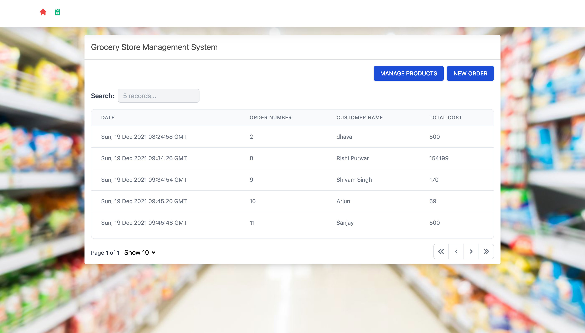
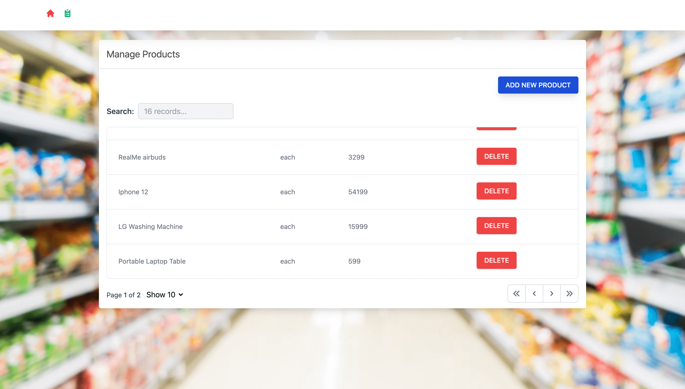
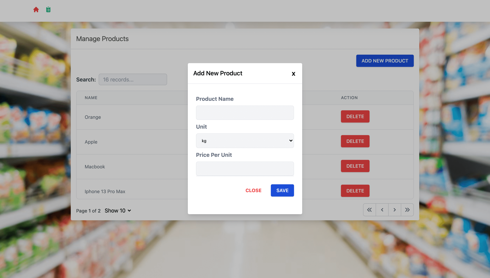
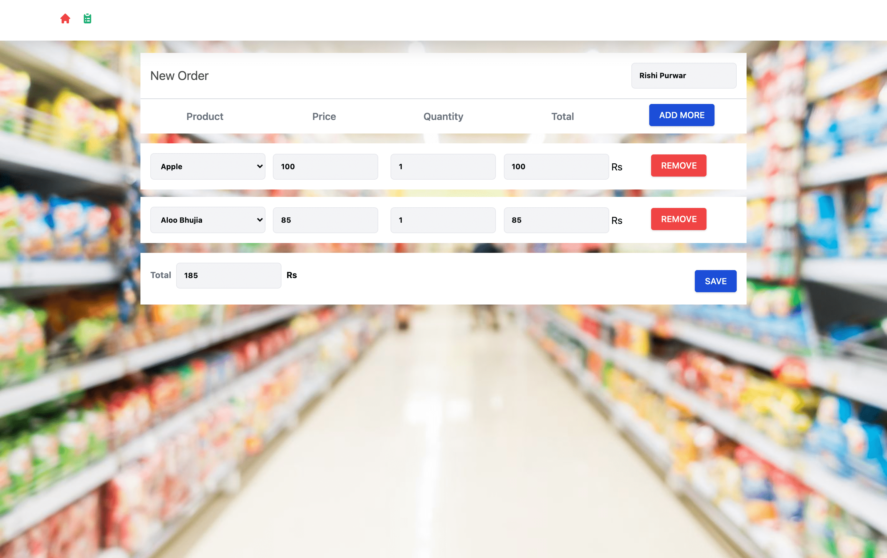

## Grocery Management App

### 1. Homepage

### 2. Products page

### 3. Add New Product Page

### 4. Add New Order Page

## 👨‍💻 Demo

Try out the website : [CodingSpace](https://grocery-management-app.vercel.app/)

## 👨‍🔧 Tech Stack

